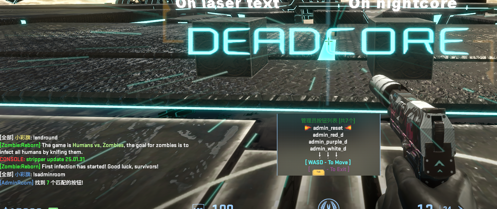

# CS2-AdminRoom Plugin

[English](#english) | [中文](#中文)

## Preview / 预览

## English

### Description

A plugin for searching admin rooms, adding or deleting admin room coordinates in Counter-Strike 2.

### Features

- Set admin room position
- Teleport to admin room
- Search for admin buttons
- Auto-search on map start
- Multi-language support
- Configurable permissions for each command
- Configurable teleport height

### Commands

-`!css_addadminroom` - Add admin room at current position

-`!css_adminroom` - Teleport to admin room

-`!css_sadminroom` - Search and teleport to admin buttons

-`!css_deladminroom` - Delete admin room for current map

### Configuration

The plugin uses two configuration files:

1.`configs/plugins/CS2-AdminRoom/CS2-AdminRoom.json`

- Keywords for button search
- Permissions for each command
- Teleport height adjustment
- Default search settings

2.`plugins/CS2-AdminRoom/adminroom.json`

- Stores admin room positions for each map
- Marks maps with no admin rooms

### Installation

1. Install [CounterStrikeSharp](https://github.com/roflmuffin/CounterStrikeSharp)
2. Install [WASDMenuAPI](https://github.com/Interesting-exe/WASDMenuAPI)
3. Place plugin files in `csgo/addons/counterstrikesharp/plugins/`
4. Configure permissions in `CS2-AdminRoom.json`
5. Restart the server

Note: If you have already installed the WASDMenuAPI, you should delete the WASDSharedAPI.dll from this plugin's compiled files list to prevent conflicts.

Search keywords are from [sm-plugin-AdminRoom](https://github.com/srcdslab/sm-plugin-AdminRoom/blob/master/addons/sourcemod/configs/adminroom/adminroom.cfg)

Contributions of admin room coordinates are welcome!

---

## 中文

### 描述

一个用于在 CS2 中搜索管理员房间、添加或删除管理员房间坐标的插件。

### 功能特点

- 设置管理员房间位置
- 传送到管理员房间
- 搜索管理员按钮
- 地图开始时自动搜索
- 多语言支持
- 可配置每个命令的权限
- 可配置传送高度

### 命令

-`!css_addadminroom` - 在当前位置添加管理员房间

-`!css_adminroom` - 传送到管理员房间

-`!css_sadminroom` - 搜索并传送到管理员按钮

-`!css_deladminroom` - 删除当前地图的管理员房间

### 配置文件

插件使用两个配置文件：

1.`configs/plugins/CS2-AdminRoom/CS2-AdminRoom.json`

- 按钮搜索关键词
- 每个命令的权限设置
- 传送高度调整
- 默认搜索设置

2.`plugins/CS2-AdminRoom/adminroom.json`

- 存储每个地图的管理员房间位置
- 标记没有管理员房间的地图

### 安装方法

1. 安装 [CounterStrikeSharp](https://github.com/roflmuffin/CounterStrikeSharp)
2. 安装 [WASDMenuAPI](https://github.com/Interesting-exe/WASDMenuAPI)
3. 将插件文件放置在 `csgo/addons/counterstrikesharp/plugins/` 目录下
4. 在 `CS2-AdminRoom.json` 中配置权限
5. 重启服务器

注意：如果您已安装WASDMenuAPI，在编译该插件时应该删除该插件编译后文件列表里的WASDSharedAPI.dll，防止冲突。

搜索关键词来自 [sm-plugin-AdminRoom](https://github.com/srcdslab/sm-plugin-AdminRoom/blob/master/addons/sourcemod/configs/adminroom/adminroom.cfg)

欢迎贡献调关房坐标信息！
